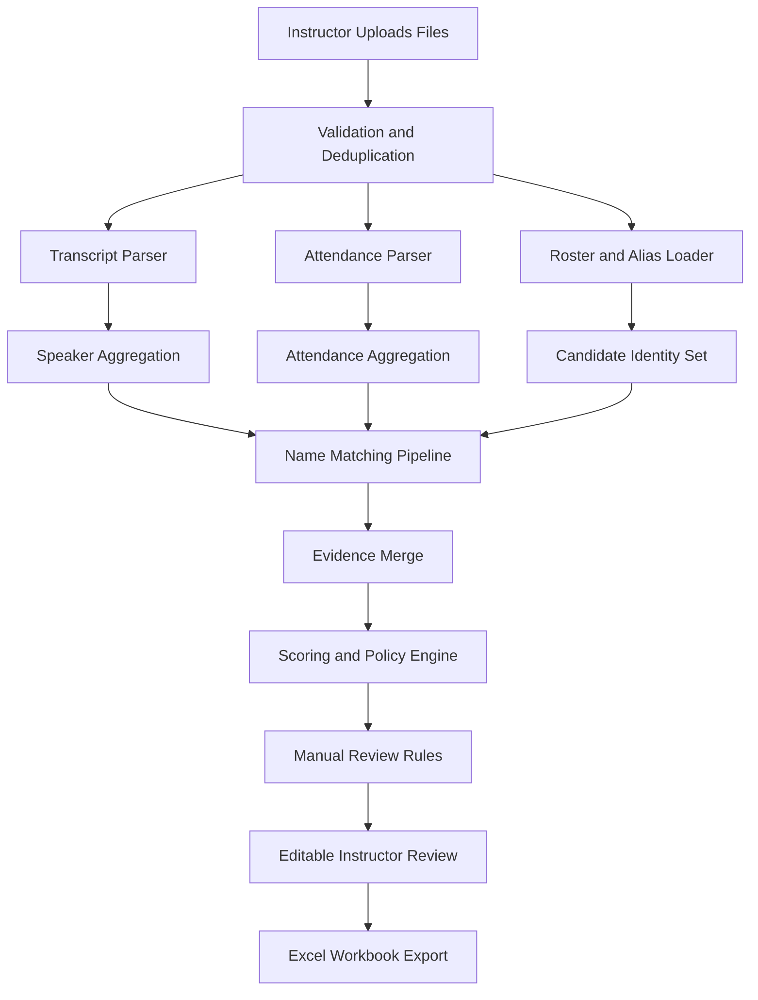
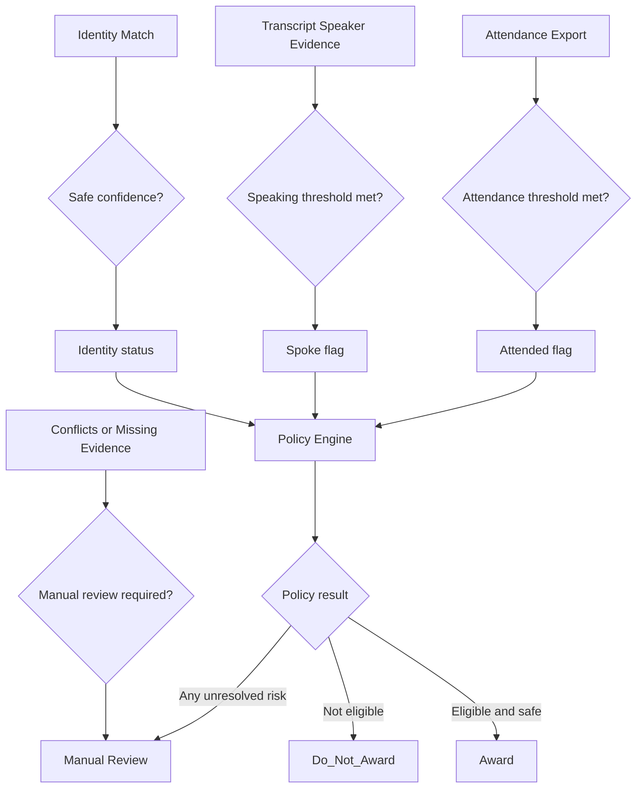
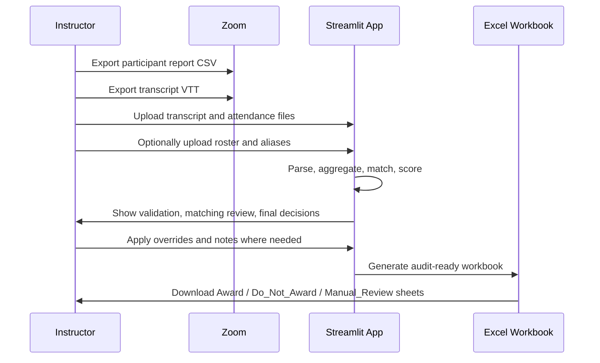

# Zoom Participation Grader

Zoom Participation Grader is a single-file Streamlit app that helps instructors combine Zoom attendance data, Zoom transcript speaking evidence, and an optional class roster into a transparent grading workbook.

The app is intentionally conservative:

- Attendance is taken from the Zoom participant export.
- Speaking is taken from the Zoom transcript.
- Transcript-only evidence never auto-awards attendance credit.
- Low-confidence identity matches and conflicting evidence are routed to manual review.

## What This Solves

This project helps answer three grading questions for each student:

- Who should receive bonus marks
- Who should not
- Who needs manual review

It is designed for real instructional workflows where display names are messy, students reconnect during class, some transcript speakers are unlabeled, and instructors still need an auditable final decision.

## Key Features

- Single-file application in [`app.py`](./app.py)
- Upload multiple Zoom transcript `.vtt` files
- Upload multiple Zoom participant export `.csv` files
- Optional roster upload in `.csv` or `.xlsx`
- Optional alias file upload in `.csv`
- Confidence-based identity matching using exact, normalized, alias, and fuzzy matching
- Transparent grading policies with sidebar controls
- Manual review workflow with session-persistent overrides
- Excel export with audit sheets and grading breakdowns
- Sample data generator built into the app

## Architecture



## Decision Flow



## Matching Strategy

The app resolves identity in this order:

1. Exact raw match
2. Normalized exact match
3. Alias match
4. Fuzzy match with RapidFuzz

Confidence defaults:

- Exact canonical match: `1.00`
- Normalized exact: `0.95`
- Alias match: `0.93`
- Fuzzy match: `similarity / 100`

The app never silently auto-credits low-confidence matches. Ambiguous matches and low-confidence fuzzy results are pushed into `Manual_Review`.

## Repository Contents

```text
.
├── app.py
├── README.md
├── requirements.txt
└── .gitignore
```

## Python Requirements

See [`requirements.txt`](./requirements.txt).

Minimal dependencies:

- `streamlit`
- `pandas`
- `openpyxl`
- `rapidfuzz`

## Run Locally

1. Clone the repo.
2. Create and activate a Python environment.
3. Install dependencies.
4. Launch Streamlit.

```bash
git clone https://github.com/royayushkr/Zoom-Participation-Grader.git
cd Zoom-Participation-Grader
python3 -m venv .venv
source .venv/bin/activate
pip install -r requirements.txt
streamlit run app.py
```

The app will open in your browser, usually at `http://localhost:8501`.

## Deploy on Streamlit Community Cloud

This repo is set up so you can deploy it directly from GitHub.

### Deployment Steps

1. Push this repository to GitHub.
2. Go to [Streamlit Community Cloud](https://share.streamlit.io/).
3. Sign in with GitHub.
4. Click `New app`.
5. Select this repository:
   `royayushkr/Zoom-Participation-Grader`
6. Choose:
   - Branch: `main`
   - Main file path: `app.py`
7. Click `Deploy`.
8. Wait for the build to install packages from `requirements.txt`.
9. Open the deployed app URL.

### Recommended Deployment Checks

After deployment, verify:

- The app loads without dependency errors
- Sample data download buttons work
- A sample transcript and attendance upload parses successfully
- The final review table renders
- The Excel workbook downloads successfully

## Real-World Instructor Workflow

Use this process during a real class or after a Zoom session.



### Step-by-Step Process Once Deployed

1. Open the deployed Streamlit app.
2. In Zoom, export:
   - Participant report CSV
   - Transcript VTT
3. Optionally export a roster from your LMS or course system.
4. Optionally prepare an alias CSV for known nickname or device-name issues.
5. In the app sidebar, set:
   - Attendance threshold
   - Speaking thresholds
   - Fuzzy match threshold
   - Safe auto-approval threshold
   - Bonus policy mode
6. Upload all meeting files for the grading batch.
7. Review the validation summary for malformed or skipped rows.
8. Review the matching section for low-confidence or ambiguous identity matches.
9. Review the final decision table.
10. Apply manual overrides only where necessary.
11. Add reviewer notes for audit context.
12. Download the Excel workbook.
13. Save the workbook alongside the original Zoom exports for recordkeeping.

## Input Files

### Required

- Zoom transcript `.vtt`
- Zoom participant export `.csv`

### Optional

- Roster `.csv` or `.xlsx`
- Alias mapping `.csv`

### Alias File Format

Recommended columns:

- `alias_name`
- `canonical_name`

Example:

```csv
alias_name,canonical_name
Johnny,John Smith
J. Doe,Jane Doe
```

## Grading Policies

The sidebar supports these decision modes:

- `attended only`
- `spoke only`
- `attended and spoke`
- `weighted score`

### Weighted Score Formula

```text
weighted_score = attendance_component + speaking_component

attendance_component = min(attendance_minutes / attendance_cap_minutes, 1.0) * attendance_weight
word_component = min(total_words / word_cap, 1.0) * word_weight
turn_component = min(total_turns / turn_cap, 1.0) * turn_weight
```

This keeps the policy transparent and easy to explain to students or teaching staff.

## Manual Review Triggers

Rows are sent to manual review when any of these happen:

- Match confidence is below the safe threshold
- Fuzzy matches are ambiguous
- Transcript speaker exists but attendance match is missing
- Attendance exists but transcript only contains `Unknown Speaker`
- Critical identifying fields are missing
- Duplicate canonical conflicts appear in the same meeting
- Evidence conflicts across files
- The instructor explicitly overrides the row into manual review

## Excel Workbook Output

The exported workbook contains these sheets:

- `Config`
- `Raw_Transcript`
- `Raw_Attendance`
- `Aggregated_Speakers`
- `Aggregated_Attendance`
- `Matched_Students`
- `Award`
- `Do_Not_Award`
- `Manual_Review`
- `Audit_Log`

### Why the Workbook Matters

The workbook is designed for auditability:

- `Config` shows the settings used
- `Raw_*` sheets preserve imported evidence
- `Aggregated_*` sheets show preprocessing results
- `Matched_Students` shows identity resolution output
- Decision sheets separate final grading actions
- `Audit_Log` captures warnings, unmatched rows, and low-confidence notes

## Best Practices for Real Use

- Upload the participant export for every meeting you are grading
- Use the transcript only as speaking evidence, never as attendance evidence
- Upload a roster when possible to improve identity confidence
- Maintain a reusable alias file for recurring nickname/device-name issues
- Review `Manual_Review` before finalizing bonus marks
- Keep the exported workbook together with the source Zoom files for audit support

## Troubleshooting

### The app says transcript-only rows cannot auto-award

This is expected behavior. Attendance must come from the Zoom participant export.

### Many students are landing in manual review

Usually this means one of these is true:

- No roster was uploaded
- Display names do not match official roster names
- Students joined using generic device names
- The fuzzy threshold is set too high or the safe threshold is too strict

### The roster was uploaded but names still do not match

Upload an alias CSV for:

- nicknames
- initials
- shortened names
- known Zoom display names

### The export workbook is empty

Check:

- at least one transcript or attendance file was uploaded
- the uploads were not empty
- the files are in supported formats

## Notes

- The app stores overrides in Streamlit session state during the current session only.
- No database or external API is required.
- The grading flow prioritizes robustness and auditability over aggressive auto-matching.
